---
title: "Recreating the Corruption and Human Data Plot"
output: 
  html_document: 
    fig_height: 4
    highlight: pygments
    theme: spacelab
---

## Setup

### Load packages


```r
library(ggplot2)
library(dplyr)
library(data.table)
```

### Load data


```r
df <- fread('Economist_Assignment_Data.csv',drop=1)
```


* * *

## Part 1: Data

```r
head(df)
```

```
##        Country HDI.Rank   HDI CPI            Region
## 1: Afghanistan      172 0.398 1.5      Asia Pacific
## 2:     Albania       70 0.739 3.1 East EU Cemt Asia
## 3:     Algeria       96 0.698 2.9              MENA
## 4:      Angola      148 0.486 2.0               SSA
## 5:   Argentina       45 0.797 3.0          Americas
## 6:     Armenia       86 0.716 2.6 East EU Cemt Asia
```
 

* * *

## Part 3: Plotting


```r
pl <- ggplot(df,aes(x=CPI,y=HDI,color=Region)) + geom_point()
pl
```

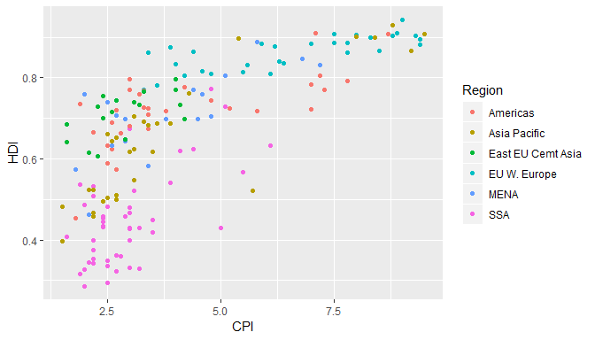<!-- -->

Telling whther a movie was popular or not after it has been selected(or awarded) for an oscar award seems pointless since it would be obvious that one would like to predict the movie's popularity beforehand.


Checking for null(missing) values


```r
pl <- ggplot(df,aes(x=CPI,y=HDI,color=Region)) + geom_point(size=4,shape=1)
pl
```

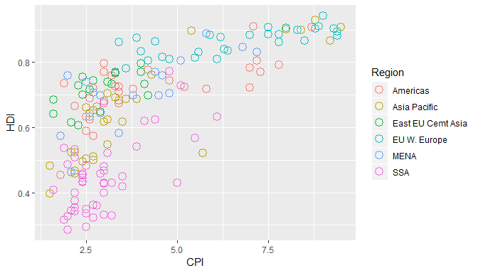<!-- -->


```r
pl + geom_smooth(aes(group=1))
```

```
## `geom_smooth()` using method = 'loess' and formula 'y ~ x'
```

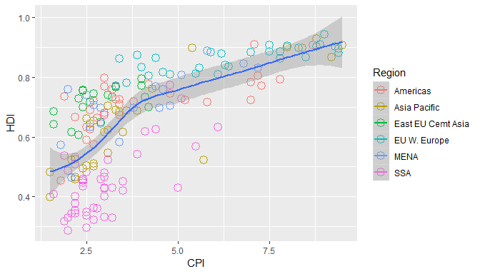<!-- -->


```r
pl2 <- pl + geom_smooth(aes(group=1),method ='lm',formula = y~log(x),se=FALSE,color='red')
pl2
```

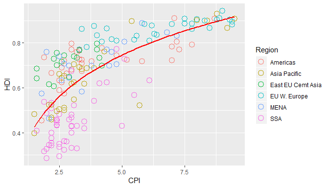<!-- -->


```r
pl2 + geom_text(aes(label=Country))
```

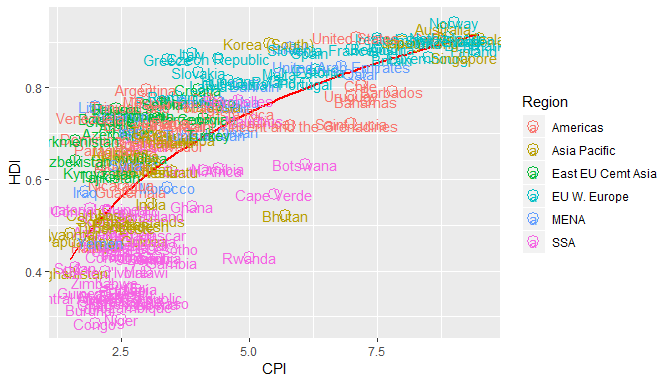<!-- -->


```r
pointsToLabel <- c("Russia", "Venezuela", "Iraq", "Myanmar", "Sudan",
                   "Afghanistan", "Congo", "Greece", "Argentina", "Brazil",
                   "India", "Italy", "China", "South Africa", "Spane",
                   "Botswana", "Cape Verde", "Bhutan", "Rwanda", "France",
                   "United States", "Germany", "Britain", "Barbados", "Norway", "Japan",
                   "New Zealand", "Singapore")

pl3 <- pl2 + geom_text(aes(label = Country), color = "gray20", 
                data = subset(df, Country %in% pointsToLabel),check_overlap = TRUE)

pl3
```

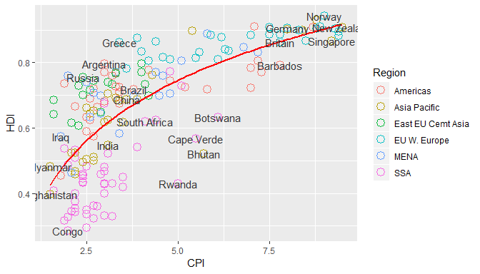<!-- -->


```r
pl4 <- pl3 + theme_bw() 
pl4
```

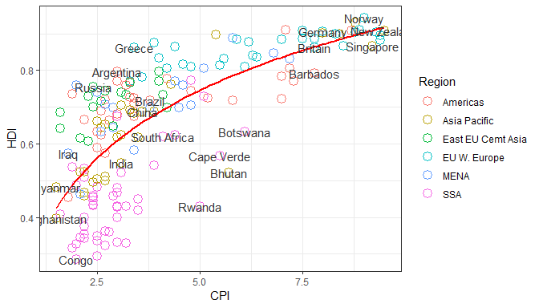<!-- -->


```r
pl5 <- pl4 + scale_x_continuous(name = "Corruption Perceptions Index, 2011 (10=least corrupt)",
                     limits = c(.9, 10.5),breaks=1:10) 
pl5
```

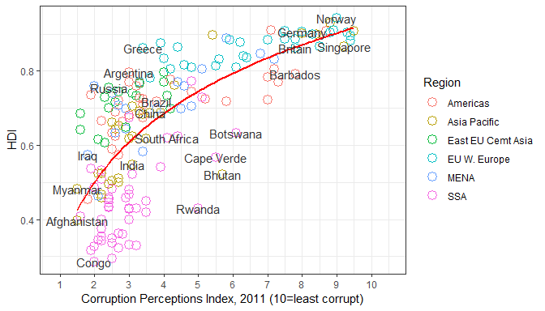<!-- -->


```r
pl6 <- pl5 + scale_y_continuous(name = "Human Development Index, 2011 (1=Best)",
                     limits = c(0.2, 1.0))
pl6
```

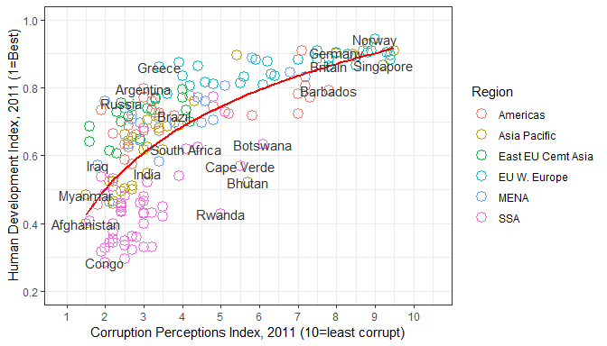<!-- -->


```r
pl6 + ggtitle("Corruption and Human development")
```

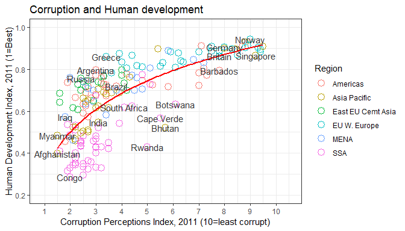<!-- -->


```r
library(ggthemes)
pl6 + theme_economist_white()
```

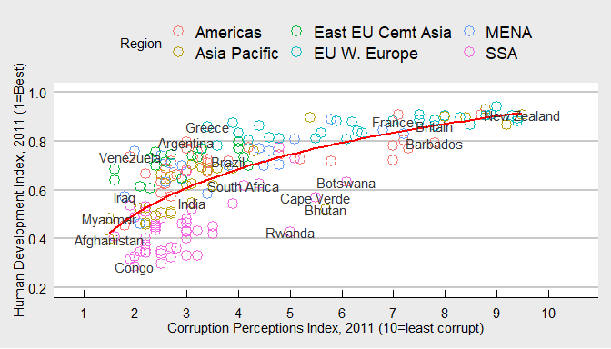<!-- -->


